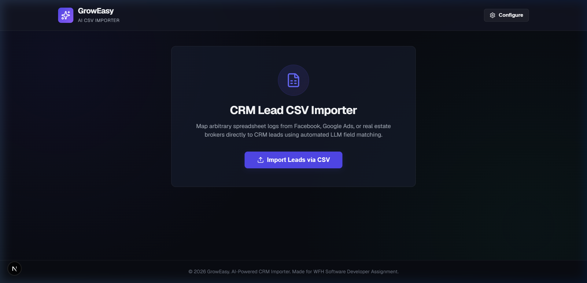
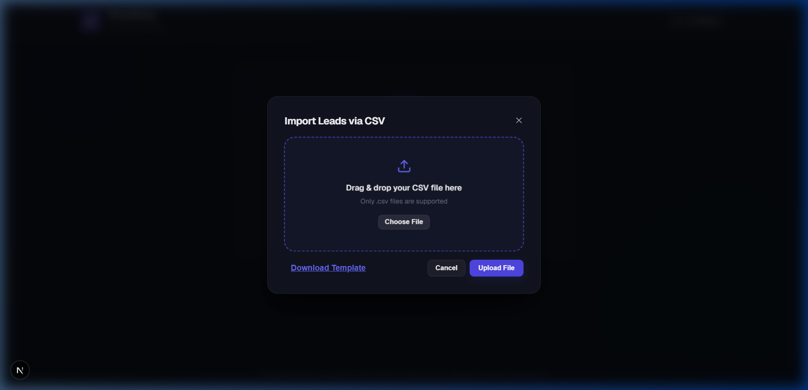
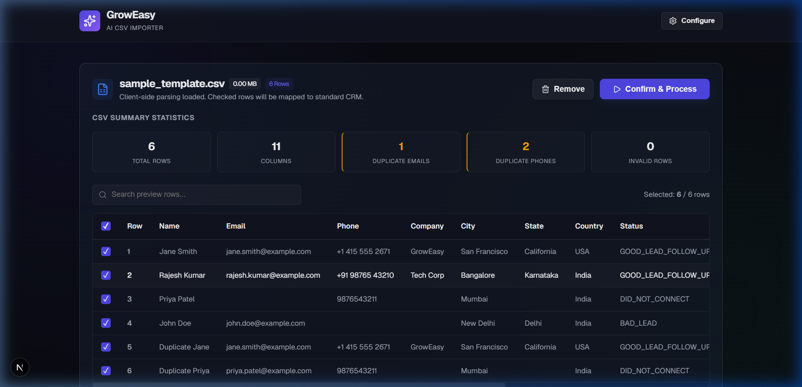
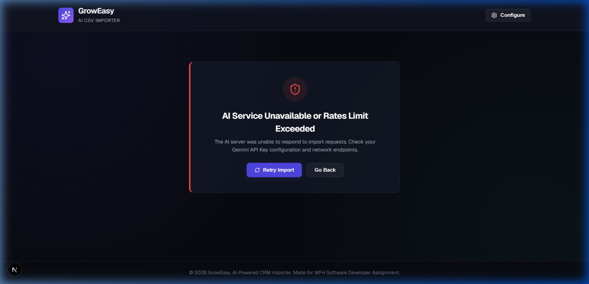
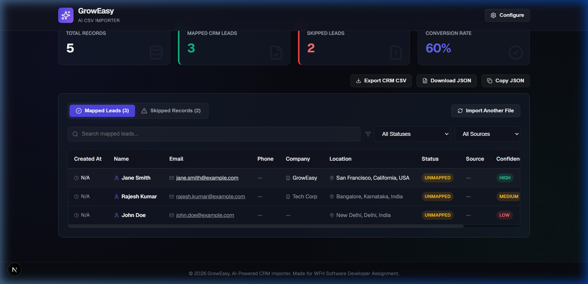
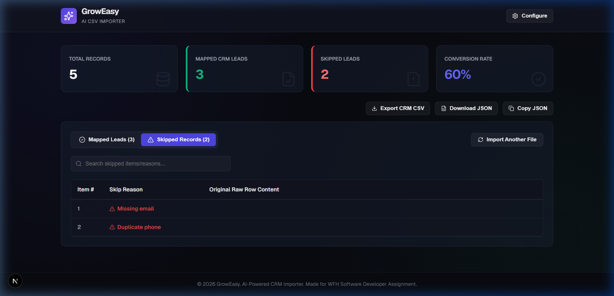

# AI-Powered CSV Importer

An AI-powered CSV Importer that allows users to upload CRM lead spreadsheets of arbitrary formats (different columns, layout, and structure), analyze statistics, filter records, and map them to the GrowEasy CRM schema using Gemini LLM.

---

## 📸 Screenshots & Interface Walkthrough

### 1. Dashboard Landing Page
Click the primary **Import Leads via CSV** button to open the modal overlay.


### 2. Upload Modal
Features a drag-and-drop zone, file size validation, file chooser, cancel actions, and a direct download helper for the sample template.


### 3. File Preview & local Summary Statistics
Locally parses the file using background workers and computes metrics: Total rows, Column count, Duplicate emails, Duplicate phones, and Invalid rows. Users can toggle individual row checkboxes to select which leads are sent to the AI mapper.


### 4. Processing Progress & Real-time Console
Performs sequential client-side batch uploads. Displays a percentage progress bar, current batch numbers (e.g. `Batch 1 / 5`), a live terminal log window, and a cancellation controller to abort subsequent requests.

*(Graceful error state displays when the AI service endpoint or API key is misconfigured or rate-limited)*

### 5. Final Mapping Results
Leads successfully mapped display with corresponding name, email, phone, location, CRM status, data source, and mapping `confidence_level` badges (`High` / `Medium` / `Low`). 


### 6. Skipped Records & Rejection Reasons
Leads filtered out by CRM rules or batch processing limitations are shown in a secondary tab detailing exact rejection reasons.


---

## 🚀 Key Features

* **Drag & Drop Modal**: Clean overlay modal matching assignment guidelines.
* **Template Download**: One-click download for `sample_template.csv`.
* **PapaParse Background Workers**: Heavy file parsing is moved to worker threads to keep the UI smooth and responsive.
* **Pre-Import Duplicate Checking**: Scans rows client-side to flag duplicate emails, phone numbers, and invalid records prior to submit.
* **Row Checkboxes**: Master and individual line-item selectors so only checked rows are imported.
* **Winston Logging**: Structured server logging containing Custom Request-ID tracing.
* **Zod Schema Validation**: Backend API validations on `/api/import` requests.
* **API Documentation**: Interactive Redoc UI and Swagger JSON endpoint available on `/api-docs` and `/swagger.json`.
* **API Rate Limiting & Security**: Express rate limiters, compression, and Helmet middleware protection.
* **Confidence Scoring**: Gemini AI evaluates formatting confidence (`High`, `Medium`, `Low`) for every mapped record.
* **Halt/Cancellation Handler**: Cancel imports midway to stop subsequent batches.
* **Post-Import Exports**: 
  * `Export CRM CSV`: Downloads the parsed records as a clean CRM-compatible CSV file.
  * `Download JSON`: Saves the raw array response as a `.json` file.
  * `Copy JSON`: Copies payload to clipboard.
* **Containerization**: Fully dockerized environment using separate multi-stage Dockerfiles and a root `docker-compose.yml` config.

---

## 🛠️ Directory Structure

```
├── backend/                # Express backend application
│   ├── src/
│   │   ├── controllers/    # Controller handling route payloads & Zod validation
│   │   ├── routes/         # Express routing configurations
│   │   ├── services/       # Gemini AI service, prompting, batching, and logger
│   │   ├── test.ts         # Backend automated test suite
│   │   └── types.ts        # Type-safety interface declarations
│   ├── Dockerfile          # Multi-stage production backend Dockerfile
│   └── package.json        # Backend dependencies & scripts
│
├── frontend/               # Next.js frontend application
│   ├── src/
│   │   └── app/            # Next.js App Router and design styles
│   ├── Dockerfile          # Production frontend Dockerfile
│   └── package.json        # Frontend dependencies & scripts
│
├── sample_csvs/            # Contains sample CSVs (Facebook, Google, Real Estate, etc.)
├── assets/                 # Screenshot assets for documentation
├── docker-compose.yml      # Orchestration setup for the docker environment
└── package.json            # Root workspace script launcher
```

---

## 🏁 Getting Started & How to Run

### Method 1: Running with Docker Compose (Recommended)

To run both services in containers with a single command, perform the following:

1. Create a `.env` file in the root workspace folder:
   ```env
   GEMINI_API_KEY=your_gemini_api_key_here
   ```
2. Build and start the services:
   ```bash
   docker-compose up --build
   ```
3. Access the applications:
   * **Frontend Website**: [http://localhost:3000](http://localhost:3000)
   * **Backend server**: [http://localhost:5000](http://localhost:5000)
   * **API Docs**: [http://localhost:5000/api-docs](http://localhost:5000/api-docs)

---

### Method 2: Running Locally (Development Mode)

#### 1. Prerequisites
* Node.js (v18+)
* NPM or Yarn

#### 2. Installation
From the root workspace directory, run:
```bash
npm run install:all
```
This script will install dependencies for the root workspace, backend, and frontend directories.

#### 3. Environment Configuration
Create a `.env` file in the `backend` folder (or copy `backend/.env.example` to `backend/.env`):
```env
PORT=5000
GEMINI_API_KEY=your_gemini_api_key_here
GEMINI_MODEL=gemini-1.5-flash
```

*(Note: If `GEMINI_API_KEY` is not provided in the backend `.env`, you can enter it directly in the frontend UI's **Configure** modal to overwrite).*

#### 4. Running the Application
To run the frontend and backend servers concurrently, execute:
```bash
npm run dev
```
* **Frontend**: [http://localhost:3000](http://localhost:3000)
* **Backend**: [http://localhost:5000](http://localhost:5000)
* **API Documentation**: [http://localhost:5000/api-docs](http://localhost:5000/api-docs)

---

## 🧪 Verification & Testing

### Automated Validation Tests
To run verification tests for CRM validation filters, schema mappings, and live Gemini API compatibility, run:
```bash
npm run test --prefix backend
```

### Manual Testing with Sample CSVs
You can upload the test files located in the `sample_csvs/` folder:
1. `sample_template.csv` (Standard template layout)
2. `facebook.csv` (Alternate names and sources)
3. `google_ads.csv` (Alternate phone styles and locations)
4. `real_estate.csv` (Broker layout with multi-contact formats and timeline texts)
